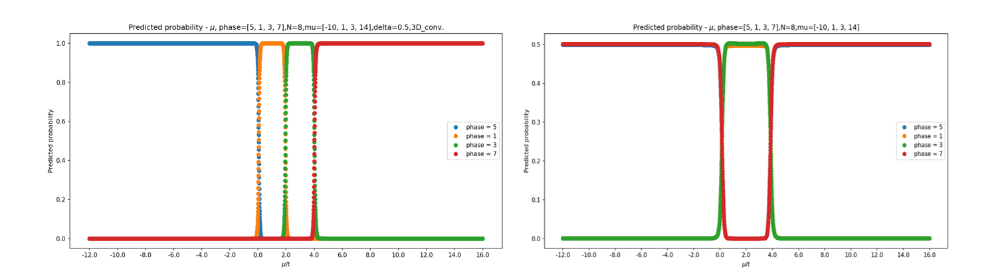

## Two_dimension_pwave_superconductor
 程式說明:

step1 開啟training_parameter.py,按照指示輸入參數
 step2 執行training_parameter.py,等待生成pkl
 step3 開啟pkl_npz_all.py,更改程式前幾行之參數
 step4 開啟pkl_npz_all.py,然後輸入pkl檔之開始時間,再輸入pkl檔之結束時間,等待執行

 Demo:
>

 note:
* 預設data路徑為"./train_data"
* 預設npz檔儲存路徑為"./npzfile"
* 預設.pkl 和 pkl_npz_all.py 為同一路徑
* Training_parameter.txt 為之前大量訓練之所有參數
* pkl_npz_all.py"可能"需更改的參數為dimension,kind_of_data,particle_data(控制test data的檔名)

 Neural Network Framework:
* Pytorch